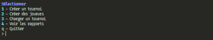
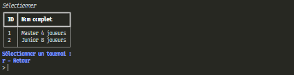
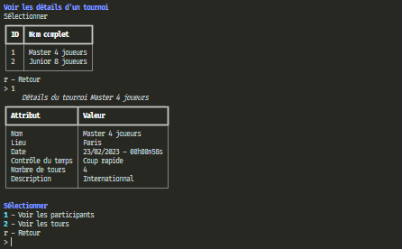
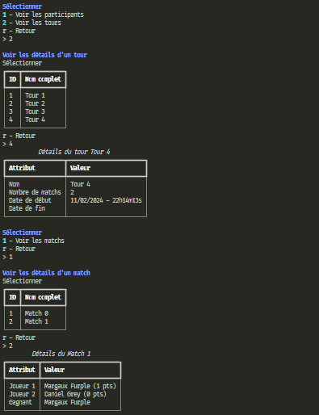
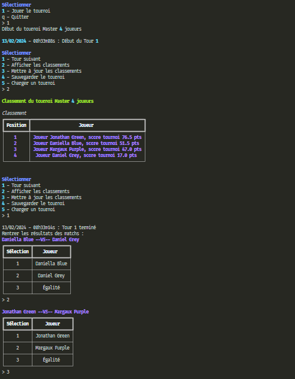
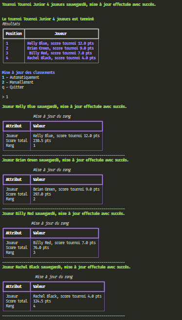

   
   

   

<div id="top"></div>

## Menu   

1. **[Informations générales](#informations-générales)**   
2. **[Liste pré-requis](#liste-pre-requis)**   
3. **[Création environnement](#creation-environnement)**   
4. **[Activation environnement](#activation-environnement)**   
5. **[Installation des librairies](#installation-librairies)**   
6. **[Exécution de l'application](#execution-application)**   
7. **[Utilisation de l'application](#utilisation-application)**   
8. **[Capture d'écran de l'interface](#capture-ecran)**   
9. **[Rapport avec flake8](#rapport-flake8)**   
10. **[Développement](#developpement)**   
11. **[Auteur et contact](#auteur-contact)**     

### Projet Chess Tournament    

- Projet de création d'un programme, dont la structure et l'utilisation et la gestion d'un tournoi d'échecs.   
  Le programme utilise le système suisse, la procédure d'appariement et d'organisation du programme respect ce même système.   
  le premier tour (appelé "rondes" aux échecs) est basé sur le classement elo des joueurs, ensuite entre le premier et le dernier tour la création d'appariement des paires est faite de façon   aléatoire et non-répétitives.   
  &nbsp;   

- Pour le dernier, tour l'appariement est fait sur le score s'ils sont égaux, alors l'appariement est fait par le classement elo.   
  &nbsp;   

- Par conséquent, de cette manière les joueurs les plus forts se rencontrent pour le tour final, il en est de même pour les joueurs les plus faibles. 
  Ainsi, avec ce système, chaque joueur participe au même nombre de matchs.   
  &nbsp;   

- Le programme est fonctionnel sur un format de **4** ou **8** joueurs avec un minimum de **4** tours par défaut.   
Il est architecturé et construit sur le design pattern ``MVC`` **(Modèles - Vues - Controlleurs)**, l'utilisation de la librairie ``TinyDB`` est   nécessaire pour sauvegarder les joueurs et les tournois.   

--------------------------------------------------------------------------------------------------------------------------------

<div id="liste-pre-requis"></div>
<a href="#top" style="float: right;">Retour en haut 🡅</a>

### Liste pré-requis   

Application conçue avec les technologies suivantes :   
- **Python** v3.7.2 choisissez la version adaptée a votre ordinateur et système.   
- **Python** est disponible à l'adresse suivante ➔ https://www.python.org/downloads/    
  &nbsp;   
  
- **TinyDB** v4.7.1   
- **Windows** 7 professionnel SP1   
  &nbsp;   

- Les scripts **Python** s'exécute depuis un terminal.   

  - Pour ouvrir un terminal sur Windows, pressez la touche ```windows + r``` et entrez ```cmd```.   
  - Sur **Mac**, pressez la touche ```command + espace``` et entrez ```terminal```.   
  - Sur **Linux**, vous pouvez ouviri un terminal en pressant les touches ```Ctrl + Alt + T```.   

--------------------------------------------------------------------------------------------------------------------------------

<div id="creation-environnement"></div>
<a href="#top" style="float: right;">Retour en haut 🡅</a>

### Création de l'environnement virtuel   

- Installer une version de **Python** compatible pour votre ordinateur.   
- Une fois installer ouvrer **le cmd (terminal)** placer vous dans le dossier principale **(dossier racine)**.   

Taper dans votre terminal :   

```bash  
$ python -m venv env
```  

>*Note : Un répertoire appelé **env** doit être créé.*   

--------------------------------------------------------------------------------------------------------------------------------

<div id="activation-environnement"></div>
<a href="#top" style="float: right;">Retour en haut 🡅</a>

### Activation de l'environnement virtuel   

- Placez-vous avec le terminal dans le dossier principale **(dossier racine)**.   

Pour activer l'environnement virtuel créé, il vous suffit de taper dans votre terminal :  

```bash 
$ env\Scripts\activate.bat
```   

- Ce qui ajoutera à chaque ligne de commande de votre terminal ``(env)``.
   
Pour désactiver l'environnement virtuel, il suffit de taper dans votre terminal :   

```bash  
$ deactivate
```

--------------------------------------------------------------------------------------------------------------------------------

<div id="installation-librairies"></div>
<a href="#top" style="float: right;">Retour en haut 🡅</a>

### Installation des librairies   

- Le programme utilise plusieurs librairies externes et modules de **Python**, qui sont répertoriés dans le fichier ```requirements.txt```.   
- Placez-vous dans le dossier où se trouve le fichier ``requirements.txt`` avec le terminal, **l'environnement virtuel doit être activé**.   
- Pour faire fonctionner le programme, il vous faudra installer les librairies requises.   
- À l'aide du fichiers ``requirements.txt`` mis à disposition.   

Taper dans votre terminal la commande :   

```bash  
$ pip install -r requirements.txt
```

--------------------------------------------------------------------------------------------------------------------------------

<div id="execution-application"></div>
<a href="#top" style="float: right;">Retour en haut 🡅</a>

### Exécution de l'application   

- Pour exécuter le programme placez vous dans le dossier principale **(dossier racine)** avec le terminal.   
>*Note : L'environnement virtuel doit être activé.*   

Taper dans votre terminal la commande :   

```bash
$ python main.py
```

--------------------------------------------------------------------------------------------------------------------------------

<div id="utilisation-application"></div>
<a href="#top" style="float: right;">Retour en haut 🡅</a>

### Utilisation de l'application   

#### Le menu principal est composé de 4 sous-menus.   

- **Créer un tournoi**   

   - Le programme permet de créer, gérer et sauvegarder des tournois d'échecs.   
   - Pendant le tournoi, vous serez invité à saisir les résultats à la fin de chaque tour.   
   - le classement est accessible après chaque tour ainsi que sa mise à jour si nécessaire.   
   - A la fin du tournoi une mise à jour manuel ou automatique peut-être faite.   
     &nbsp;   

- **Créer des joueurs**   
   - Création de joueurs que vous pourrez charger pour un tournoi.   
     &nbsp;   

- **Charger un tournoi**   
   - Charge le tournoi sélectionné à partir de la base de données.   
     &nbsp;   

- **Voir des rapports**   
   - Dans cette section, vous pouvez consulter différents rapports.   
   - Consulter le classement et les informations sur les joueurs.   
   - Consulter les détails d'un tournoi : classements des joueurs, les tours et les matchs de chaque tournoi.   

--------------------------------------------------------------------------------------------------------------------------------

<div id="capture-ecran"></div>
<a href="#top" style="float: right;">Retour en haut 🡅</a>

### Interface de l'application   

. **Capture d'écran du menu principal.**   

   

. **Capture d'écran chargement de tournoi.**   

   

. **Capture d'écran détails de tournoi.**   

   

. **Capture d'écran rapport d'un tour et d'un match.**   

   

. **Capture d'écran détails d'un match.**   

   

. **Capture d'écran détails d'une mise à jour.**   

   

--------------------------------------------------------------------------------------------------------------------------------

<div id="rapport-flake8"></div>
<a href="#top" style="float: right;">Retour en haut 🡅</a>

### Rapport avec flake8   

- Le repository contient un rapport **flake8**, qui n'affiche aucune erreur.   

```html   
<div id="all-good">
    <span class="count sev-4">
      <span class="tick">&#x2713;</span>
    </span>
    <h2>All good!</h2>
    <p>No flake8 errors found in 16 files scanned.</p>
</div>
```   

- Il est possible d'en générer un nouveau en installant le module ```flake8``` s'il n'est pas installé. 

Installation de **flake8** en entrant dans votre terminal la commande :   

```bash
$ pip intall flake8-html
```

- Créer un fichier ```.flake8``` si il n'existe pas.   

Ecrire le texte suivant dedans :   

```bash
[flake8]
exclude = .git, env, __pycache__, .gitignore
max-line-length = 119
ignore = F841
filename = main_menu.py
```

Tapez dans votre terminal la commande :   

```bash
$ flake8 --format=html --htmldir=flake-report
```   

- Un rapport sera généré dans le dossier ``flake-report``.   

--------------------------------------------------------------------------------------------------------------------------------

<div id="developpement"></div>
<a href="#top" style="float: right;">Retour en haut 🡅</a>

### Développement   

#### Actuellement en cours de développement   

- Une interface avec **Tkinter**.   
- Une fonction pour voir le temps total d'un tournoi.   
- Une fonction générant un fichier csv des tournois et des joueurs.   

--------------------------------------------------------------------------------------------------------------------------------

<div id="auteur-contact"></div>
<a href="#top" style="float: right;">Retour en haut 🡅</a>

### Auteur et contact   

Pour toute information supplémentaire, vous pouvez me contacter.   
**Bubhux:** bubhuxpaindepice@gmail.com   
